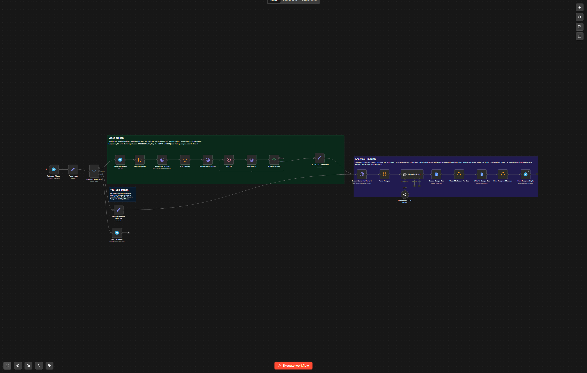
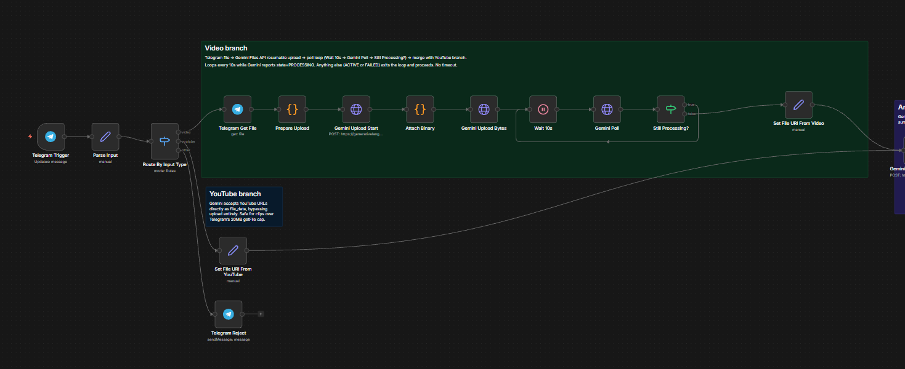
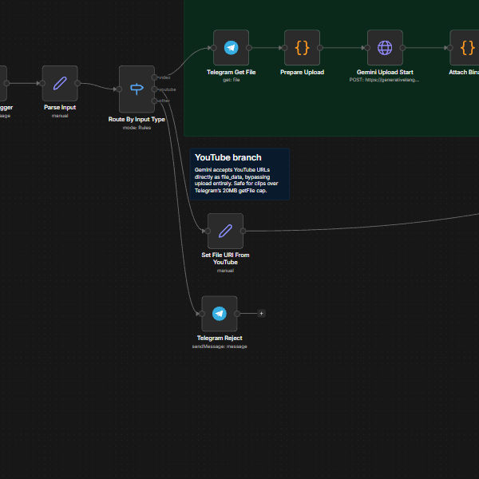
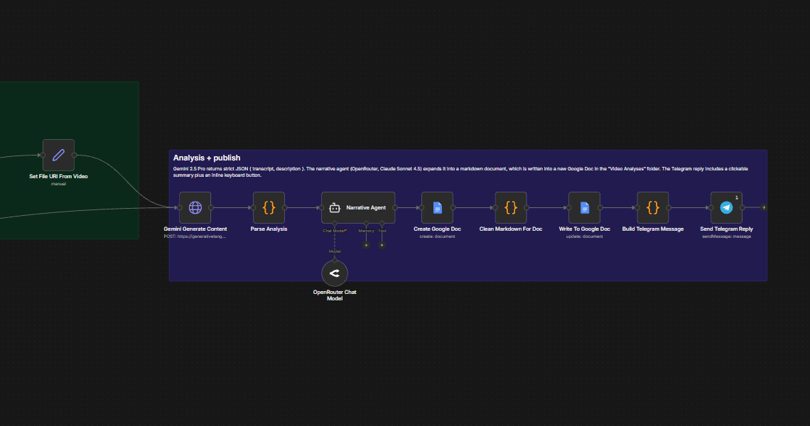

# Video Analysis Agent

> Send a video file or paste a YouTube URL into a Telegram bot. Get back a structured Google Doc — summary, key moments, visual walkthrough, transcript — and a one-tap link to open it.



## What it does

- Accepts either an **uploaded video** (up to Telegram's 20 MB cap) **or a YouTube URL** in any Telegram message.
- Uploads the file to **Gemini's Files API** (resumable upload), polls until processing completes.
- For YouTube, hands Gemini the URL directly — no download.
- Generates a structured JSON analysis with `gemini-2.5-pro`.
- Hands the JSON to a **Claude Sonnet 4.5 narrative agent** (via OpenRouter) to produce polished markdown.
- Creates a Google Doc in your "Video Analyses" folder with title `Video Analysis — YYYY-MM-DD HH:mm — msg <id>`.
- Replies in Telegram with a short summary and an inline `Open analysis` button.

## Architecture

```mermaid
flowchart LR
    TG[Telegram User] --> T[Telegram Trigger]
    T --> P[Parse Input]
    P --> R{Route}
    R -- video --> GF[Telegram Get File] --> US[Gemini Upload Start]
    US --> UB[Gemini Upload Bytes] --> WP[Wait + Poll Loop]
    WP --> SU[Set File URI]
    R -- youtube --> SU
    R -- other --> X[Telegram Reject]
    SU --> GC[Gemini Generate Content]
    GC --> PA[Parse Analysis JSON]
    PA --> NA[Narrative Agent - Claude Sonnet]
    NA --> CD[Create Google Doc]
    CD --> WD[Write Doc Body]
    WD --> BM[Build Telegram Message]
    BM --> SR[Send Telegram Reply with Open button]
```



## Tech stack

- [n8n](https://n8n.io) (self-hosted, recent enough to support Gemini Files API HTTP calls)
- Google Gemini 2.5 Pro (analysis)
- OpenRouter → Claude Sonnet 4.5 (narrative formatting)
- Telegram Bot API
- Google Drive + Docs (output)

## Setup

1. **Self-host n8n.** Docker quickstart:
   ```bash
   docker run -it --rm --name n8n -p 5678:5678 -v n8n_data:/home/node/.n8n n8nio/n8n
   ```
2. **Create a Drive folder** for outputs (e.g. "Video Analyses"). Note its ID — you'll wire it into the `Create Google Doc` node after import.
3. **Create credentials in n8n** (Settings → Credentials):
   - **Telegram Bot** (bot token from BotFather)
   - **Google Drive OAuth2**
   - **Google Docs OAuth2**
   - **HTTP Request - Gemini Files API**: header auth with `x-goog-api-key: <your Gemini API key>`. Used by the upload + poll nodes.
   - **Google Gemini (PaLM) API** for the structured-content generate call.
   - **OpenRouter API** for the narrative-formatting agent.
4. **Import the workflow:** Workflows → Import from File → [`workflow/video-analysis-agent.n8n.json`](workflow/video-analysis-agent.n8n.json).
5. **Wire credentials** on each node that shows a yellow "missing credentials" badge.
6. **Set the output folder** in `Create Google Doc` (resourceLocator → Folder → pick yours).
7. **Activate** the workflow.
8. Send your bot a video — wait ~30s for Gemini to process, then the Google Doc link should arrive.

> **Telegram caps uploads at 20 MB** for bot downloads. For longer / larger videos, paste a YouTube URL instead — Gemini handles those server-side and the cap doesn't apply.

## Environment variables

Optional — only for the `tools/` helper scripts. Copy `.env.example` to `.env`.

| Variable | Purpose | Where to get |
|---|---|---|
| `N8N_BASE_URL` | Your n8n instance URL | e.g. `http://localhost:5678` |
| `N8N_API_KEY` | n8n personal API key | n8n → Settings → API |
| `N8N_VIDEO_ANALYSIS_WORKFLOW_ID` | Workflow ID once imported | Visible in the URL |

## Tools

- `python tools/verify_workflow.py workflow/video-analysis-agent.n8n.json` — JSON sanity-check.
- `python tools/sync_workflow.py workflow/video-analysis-agent.n8n.json` — push edits to running n8n.
- `python tools/list_executions.py --workflow <id>` — recent runs.
- `python tools/fetch_execution.py <execution_id>` — drill into one run (great for debugging timeouts).

## Screenshots

Per-branch detail views of the canvas:



*Video branch: Telegram file → Gemini Files API resumable upload → poll loop until processing completes.*



*YouTube branch: bypasses upload entirely, hands Gemini the URL.*



*Analysis + publish: Gemini 2.5 Pro returns structured JSON, Claude Sonnet 4.5 (via OpenRouter) formats it as markdown, then writes a new Google Doc and replies in Telegram with a clickable link.*

## See also

- [Workflow SOP](workflow/video-analysis-agent.md) — the prose version of the topology.
- [WAT framework](docs/WAT-framework.md) — the **W**orkflows / **A**gents / **T**ools pattern.

## Credits

Built on [n8n](https://n8n.io). Companion repos in the same series:

- [ocr-invoice-agent](https://github.com/JKP143/ocr-invoice-agent)
- [agentic-rag-agent](https://github.com/JKP143/agentic-rag-agent)
- [legal-ai-agent](https://github.com/JKP143/legal-ai-agent)

## License

MIT — see [LICENSE](LICENSE).
